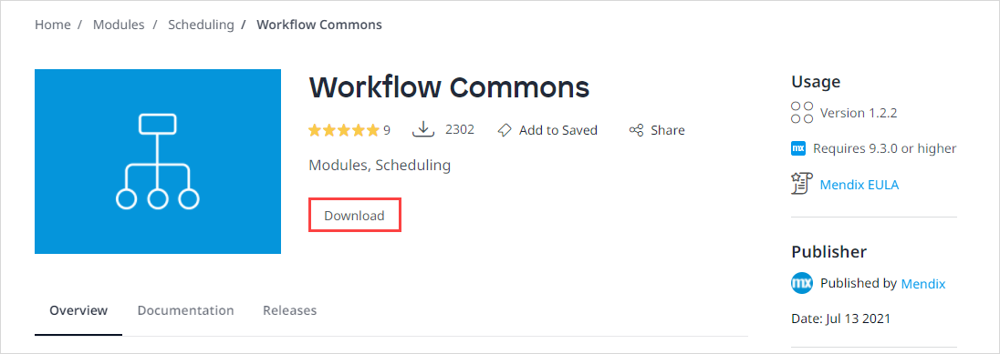

## 1 Introduction

*Modules* are a way to split the functionality of your application into separate parts. A Mendix app consists of modules: a **System** module, a [UI resources package](ui-resources-package), modules downloaded from the [Mendix Marketplace](/appstore/modules), and one or more user-defined modules. For example, a web shop can put order management in a different module than customer and product management. Studio Pro does not enforce any kind of module structure; it is up to you to choose logical modules for your app.

A module always contains exactly one [domain model](domain-model). The domain model is a data model that describes the information in your application domain in an abstract way.

Within a module you can define [module security](module-security) via module roles and specify security settings of those module roles for pages, microflows, entities and datasets.

A module can contain many different types of documents. Each type of document is described in its own domain-specific language (DSL). For example, user-interface forms are described by using a visual language with elements like text boxes, tables, and grids. Below you see tables grouped by category of all the different kinds of documents you can create within a module.

{}
Mendix Modules are distinct from React Native modules. 

Mendix modules are portions of your app which can include a data model, logic, and UI with a portable security model. 

React Native modules expose native Java/Objective-C and C++ objects allowing for React Native apps (in Mendix apps you can leverage these modules via widgets or JavaScript actions to use device sensors or capabilities).
{}

## 2 Document Categories 

### 2.1 Common

| Document type | Typical elements | Description |
| --- | --- | --- |
| [Pages](pages) | [Data view](data-view), [Data grid](data-grid), [Table](table), [Text box](text-box) | Pages are used to create a user interface for the end-user. They are composed of components that are called widgets. |
| [Workflows](workflows) | [User Task](user-task), [Decision](decision-in-workflows) | Workflows allow you to build extendable processes. |
| [Microflows](microflows) | [Activities](activities), [Sequence Flow](sequence-flow) | Microflows describe the logic of your application. They are composed of activities that manipulate objects, interact with the client, etc. |
| [Nanoflows](nanoflows) | [Activities](activities) | Nanoflows are similar to microflows: they allow you to express the logic of your application. However, they do have some specific benefits (for example, they run directly on the browser/device and can be used in an offline app). |
| [Enumerations](enumerations) |   | An enumeration is a set of predefined values, for example: in a web shop, an enumeration called *MemberType* could have the values *Gold* and *Silver*. |

### 2.2 Page Resources

| Document type | Description |
| --- | --- |
| [Images](images) | Images can be used to brighten up your application. Navigation items and the various kinds of buttons have small images (icons) to left of their captions. |
| [Layouts](layout) | Layouts specify what comes where. Each  [page](page) is based on a layout. The layout contains widgets and structures that return on every page based on that layout.  |
| [Menus](menu) | A menu document defines a navigation menu that can be used by a  [menu widget](menu-widgets). |
| [Snippets](snippet) | Snippets define reusable interface parts. They can be used on  [pages](page) and  [layouts](layout) . |

### 2.3 Resources

| Document type | Description |
| --- | --- |
| [Constants](constants) | Constants are used to define a constant value, for example: to store an URL to a webservice. |
| [Datasets](data-sets) | A dataset can be used for reporting and is defined using either an OQL query or a custom Java action. |
| [Document Templates](document-templates) | Document Templates are used to model a template needed as input for a document export action which can generate all kinds of documents based on application data. They are composed much in the same way as Forms. |
| [Java Actions](java-actions) | With Java actions you can extend the functionality of your application in situations where it would be hard to implement this functionality in microflows. You can call a Java action from a microflow. |
| [Regular Expressions](regular-expressions) | A regular expression is used by [validation rules](validation-rules) on an entity to describe a set of criteria that a string can match. |
| [Rules](rules) | A rule defines a set of criteria, with a certain input the rule will result in a Boolean or enumeration depending on the criteria met. It can be called from a decision to determine the direction the microflow should go once the decision is reached. |
| [Task Queue](task-queue) | A task queue runs continuously to check if any microflow tasks have been added to it and executes the tasks in the background. |
| [Scheduled Events](scheduled-events) | A scheduled event is used to execute a microflow at a certain point in time. You can also schedule it to repeat after a given time. For example, a scheduled event can run every morning at 6 A.M. |

### 2.4 Consumed Services

| Document type | Description |
| --- | --- |
| [Consumed Web Services](consumed-web-services) | Importing web services of other applications (Mendix or otherwise) allows you to call those web services from your microflows. |
| Domain-to-XML mapping | A domain-to-XML mapping defines a translation from domain model objects to XML objects. |
| XML-to-domain mapping | An XML-to-domain mapping defines a translation from XML objects to domain model objects. |
| [XML Schemas](xml-schemas) | An XML schema is defined in an XML Schema Definition (XSD) file and can be imported in your model. It describes what a certain XML document should look like. |

### 2.5 Published Services

| Document type | Description |
| --- | --- |
| [Published REST Services](published-rest-services) | A microflow can be published as a REST service operation so that it can be consumed by other Mendix applications. |
| [Published OData Services](published-odata-services) | Persistable entities can be exposed as an OData resource, so that they can be imported by third-party applications such as Excel. |
| [Published Web Services](published-web-services) | A microflow can be published as a web service operation so that it can be called by third-party applications. |

## 3 Importing a Module from the Mendix Marketplace

You can download modules from the [Mendix Marketplace](https://marketplace.mendix.com/) and add them to your app. Marketplace modules provide new functionality to your app, for example, allow you to use workflows. 

To add a Marketplace module to your app, do the following:

1. Go to the the [Mendix Marketplace](https://marketplace.mendix.com/).

2. Either open the Modules category in the sidebar or search for a specific module in the search bar in the top-right.

3. Open the module page and click **Download**.

    

4. Open your app in Studio Pro.

5. Right-click anywhere in the App Explorer and select **Import module package**.

6. Navigate to the folder where you saved the downloaded module and double-click the module.

7. In the **Import Module** pop-up dialog, double-check the name of the module and **Add as a new module** (unless you would like to update the existing module, for more details on how to update the module, see [Updating the Existing Module](#update-module) section below). 

8. Click **Import**.

You have added a new module to your app.

## 4 Updating the Existing Module {#update-module}

